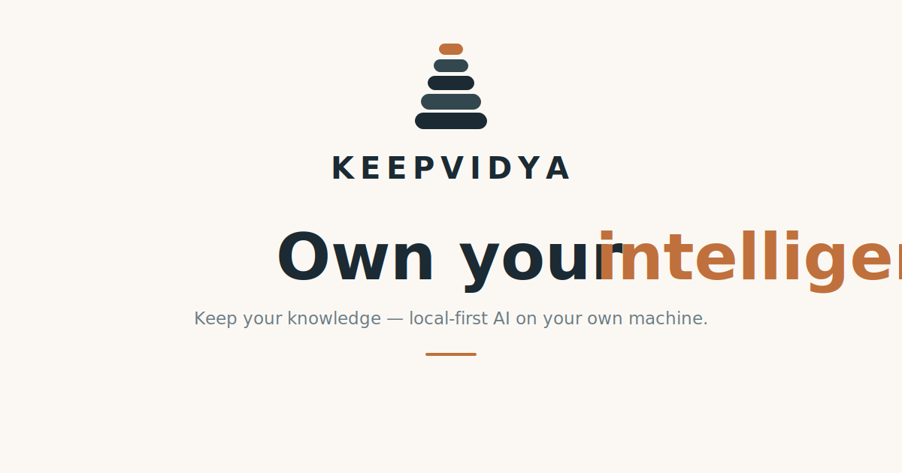
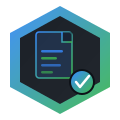
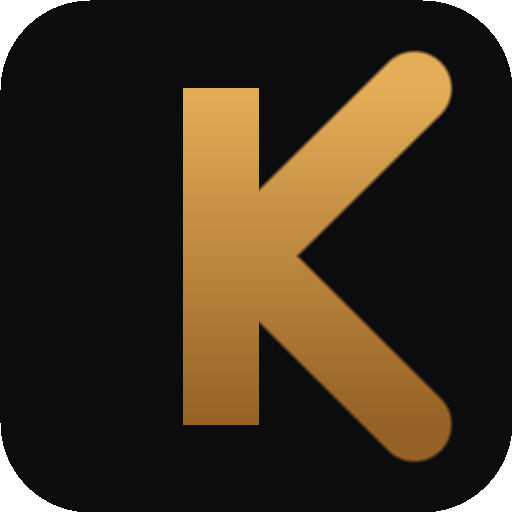
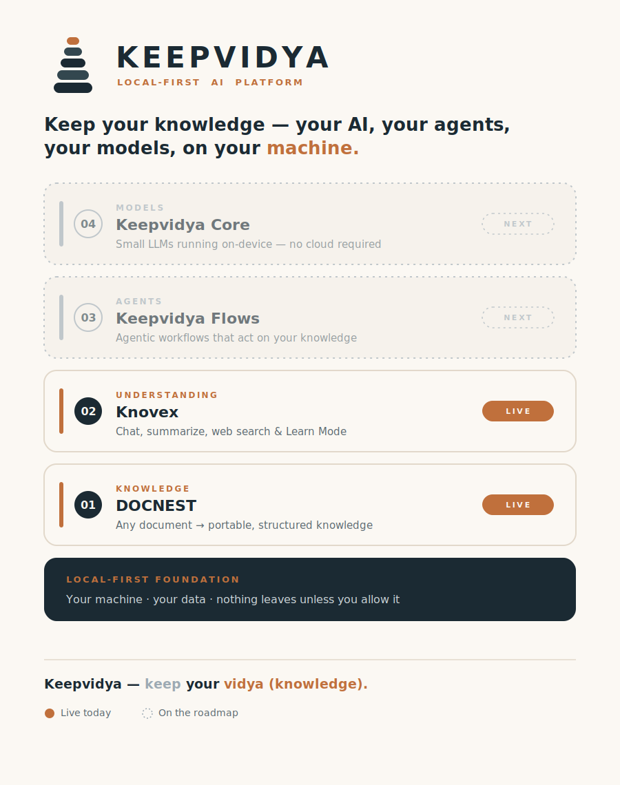
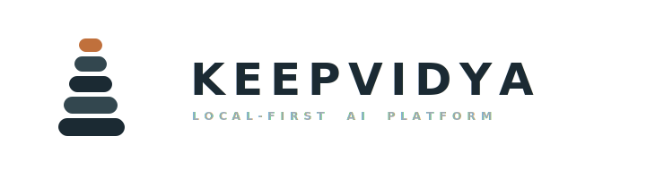

<picture>
  <source media="(prefers-color-scheme: dark)" srcset="assets/keepvidya-hero-dark.svg" />
  
</picture>

 

**The local-first AI platform. Your knowledge, your learning, your machine.**

[Why local-first](#why-local-first) ·
[DOCNEST](#-docnest--first-the-engine) ·
[UDF](#-udf--the-format-you-own) ·
[Knovex](#-knovex--then-the-app) ·
[DocNest .NET](#-docnest-net--the-engine-for-c) ·
[The platform](#the-platform--four-layers-one-foundation) ·
[Writing](#-writing--the-blog)

---

Most AI reads your private documents on **someone else's computer**, charges you to re-read them **every single time**, and forgets all of it the second you close the tab. You walk away having learned nothing and kept nothing.

**Keepvidya** = **Keep** (English) + **Vidya** (Sanskrit: *knowledge*) — *keep your knowledge.* It runs on hardware you own, and nothing leaves your machine unless you allow it. Two pieces are live today; everything below is real and shipping.

---

##  DOCNEST — first, the engine

Here's a revenue table the way most RAG tools hand it to an AI — and the way **DOCNEST** does:

| ❌ Blind chunking (the usual) | ✅ DOCNEST |
|---|---|
| <pre>"45.2% Q3 Europe 38.1% Q2 Europe 41.7% Q3 Asia 29.3%"</pre> | <pre>{ "section": "§4.2 Revenue by Region",   "table": {     "headers": ["Region","Q2","Q3"],     "rows": [["Europe","38.1%","45.2%"],              ["Asia","29.3%","41.7%"]] } }</pre> |
| Numbers with no meaning. The model is guessing. | Structure the model can actually reason about. |

DOCNEST reads a document's **structure before its content** — every heading a navigable `§section`, every table kept intact as `{ caption, headers, rows[] }` — and writes it all into a portable `.udf` file. Do that across a whole document and something useful happens: **most factual questions stop needing the LLM at all.** DOCNEST answers them straight from the structure it already built.

> **80% of factual queries · 100% accuracy · ~92% fewer tokens** than naive RAG.

The bill for *"what was Q3 revenue?"* becomes **zero**. The LLM only shows up when you actually need it to think. Retrieval is hybrid — keyword + semantic vectors + a section-graph — and any AI agent can plug in over an **MCP server**, no per-language port required.

[**DOCNEST →**](https://github.com/tailorgunjan93/docnest) · [`pip install docnest-ai`](https://pypi.org/project/docnest-ai) · [How the parser works →](https://coderlegion.com/18673/i-built-a-pdf-parser-that-actually-preserves-table-structure-for-rag-heres-why-it-matters)

---

## 📦 UDF — the format you own

Every DOCNEST conversion produces a **`.udf`** — an open, ZIP-based portable knowledge file. Embed a document **once**; query it free forever. Email it, copy it to a USB stick, carry it to a new laptop — it's a single self-contained file, in a format **no vendor controls**.

The spec is open and the licence is **CC BY 4.0**. The `.udf` you make today still opens tomorrow, with or without us.

[**Read the `.udf` spec →**](https://github.com/tailorgunjan93/udf-spec)

---

##  Knovex — then, the app

Cloud notebooks let you *chat* with your documents. **Knovex makes you learn them.**

Drop in a PDF and it will give you cited answers, summarise a file or a whole collection, and optionally pull in live web search. Then **Learn Mode** turns the topic into:

- **Quizzes** — interactive, with XP, levels and streaks, because finishing things beats starting them.
- **Flashcards** — that resurface on a **spaced-repetition** schedule.
- **Animated lessons** — that **draw themselves one idea at a time**, the way a good teacher uses a whiteboard: the focus glows, the rest dim, one beat at a time.

It's a real desktop app — **Windows, macOS, Linux, auto-updating** — built on **DOCNEST**. Bring your own AI key, or run it **fully offline** with Ollama. Your files never leave the machine unless you flip web search on yourself. And when you're done, you keep a **`.udf`** — your document's knowledge baked into a file that's *yours*.

[**⬇ Download Knovex →**](https://tailorgunjan93.github.io/knovex/) · [Repo](https://github.com/tailorgunjan93/knovex) · [The build story →](https://coderlegion.com/19280/i-built-a-local-first-ai-desktop-knowledge-base-heres-what-i-learned)

---

## 🟣 DocNest .NET — the engine, for C#

The same engine, idiomatic for **.NET 8** and shipping on NuGet. Its `.udf` files are **byte-compatible** with the Python engine — proven by interop tests, not promises — with **local ONNX embeddings** so it runs entirely on the box. For the enterprise and the regulated shops that live in C#: no Python sidecar to deploy, no second runtime to babysit.

[**DocNest .NET →**](https://github.com/tailorgunjan93/docnest-net) · [NuGet](https://www.nuget.org/profiles/GunjanTailor) · [Why it exists →](https://coderlegion.com/20665/your-net-rag-stack-hides-a-python-sidecar-i-built-the-engine-that-removes-it)

---

## Why local-first

The defensible idea was never "AI." It's **local-first**: the private alternative to the cloud, where your data is yours by default, not by permission.

| Cloud AI | Keepvidya |
|---|---|
| Your documents leave your machine | They stay on your hardware |
| Re-embeds — and re-bills — every query | Embed **once**, query for free |
| You chat, then forget | You **learn it**, and keep a `.udf` |
| Vendor lock-in | Open format, swappable models, MIT |

---

## The platform — four layers, one foundation

Four capabilities sit on a single local-first foundation. We **lead with what's live and mark the future as the future** — copper is shipped; muted slate is the roadmap.

| Layer | Product | What it does | Status |
|---|---|---|:--:|
| **Knowledge** | DOCNEST | Any document → portable, structured `.udf` | 🟠 **Live** |
| **Understanding** | Knovex | Cited chat, summaries, web search & Learn Mode | 🟠 **Live** |
| **Agents** | Keepvidya Flows | Agentic workflows that act on your knowledge | ◻ Roadmap |
| **Models** | Keepvidya Core | Small LLMs running on-device — no cloud | ◻ Roadmap |

Under-claim, over-deliver.

---

## 📝 Writing — the blog

Long-form on how this is built and why it matters. Profile: **[Gunjan Tailor on CoderLegion](https://coderlegion.com/user/Gunjan+Tailor)** — 561 points, 20 badges.

| # | Title | Where | Published |
|:--:|---|---|---|
| 1 | [Your .NET RAG stack hides a Python sidecar. I built the engine that removes it.](https://coderlegion.com/20665/your-net-rag-stack-hides-a-python-sidecar-i-built-the-engine-that-removes-it) | CoderLegion · *DocNest .NET* | Jun 2026 |
| 2 | [I Built a Local-First AI Desktop Knowledge Base — Here's What I Learned](https://coderlegion.com/19280/i-built-a-local-first-ai-desktop-knowledge-base-heres-what-i-learned) | CoderLegion · *Knovex* | May 2026 |
| 3 | [I built a PDF parser that actually preserves table structure for RAG: here's why it matters](https://coderlegion.com/18673/i-built-a-pdf-parser-that-actually-preserves-table-structure-for-rag-heres-why-it-matters) | CoderLegion · *DOCNEST* | May 2026 |
| 4 | [I Built a Local-First AI Desktop Knowledge Base](https://dev.to/gunjantailor/i-built-a-local-first-ai-desktop-knowledge-base-heres-what-i-learned-3o4a) | DEV Community · *Knovex* | May 2026 |

---

> **A quick note — "Gunjan" is becoming Keepvidya.** These products were built by **Gunjan Tailor** ([@tailorgunjan93](https://github.com/tailorgunjan93)) and are consolidating under the **Keepvidya** organization. Repos still live under `tailorgunjan93/*` during the migration — every link above points to its real, working home.

---

<picture>
  <source media="(prefers-color-scheme: dark)" srcset="assets/keepvidya-logo-dark.svg" />
  
</picture>

**Two products live. Nothing leaves your machine.**

[**⬇ Download Knovex**](https://tailorgunjan93.github.io/knovex/) · [**⭐ Star DOCNEST**](https://github.com/tailorgunjan93/docnest) · [**📦 Read the `.udf` spec**](https://github.com/tailorgunjan93/udf-spec)

### Own your intelligence.

Questions, partnerships, or just hello → **[founder@keepvidya.com](mailto:founder@keepvidya.com)**

DOCNEST & DocNest .NET — MIT · UDF — CC BY 4.0 · Ink `#1B2A33` + Copper `#C0703C`

